## Installing softwares on windows server 2019 from ubuntu vm

### Pre-requisites:

* First of all, we need 2 VM's one is Ubuntu VM and another would be Windows server 2019
* For the demonstration purpose I'll be creating these VM's on Azure but you can create on any cloud

### Configurations:

* Manually I have created the VM's but we can also create them from Terraform/ARM templates/Azure Biceps/PowerShell CLI
    
    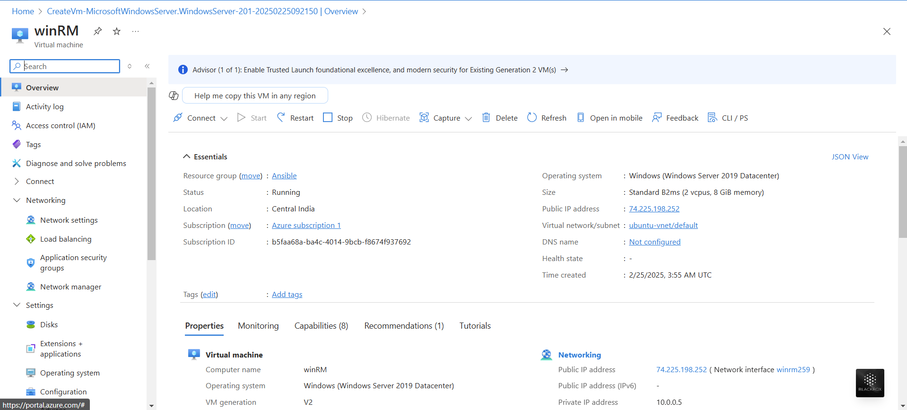
    
    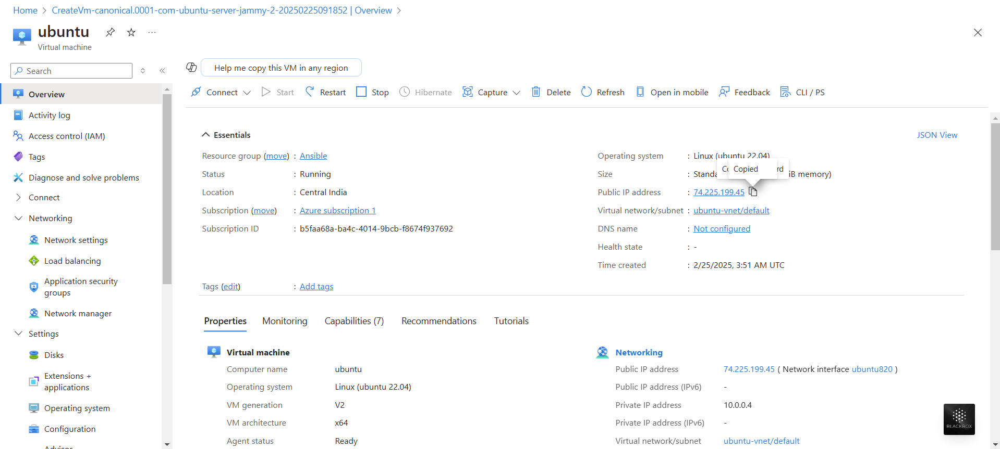

* Next connect to the ubuntu VM and check if python is present or not.
* So, as part of ansible installation python needs to be installed before installing ansible on Ansible Control Node (ACN) and should also be present on all the nodes where we'll connect and install the applications
  
  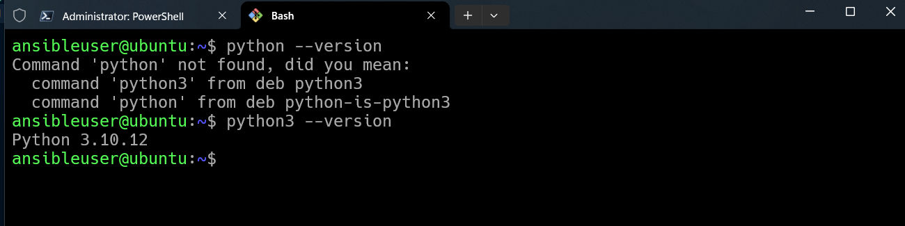

* Since, the python is present in ubuntu-vm, we'll start with further steps by installing Ansible
* Remember, we only need to install Ansible on Ansible Control Node (ACN) 

* [Install Ansible](https://docs.ansible.com/ansible/latest/installation_guide/installation_distros.html#installing-ansible-on-ubuntu)

```bash
sudo apt update
sudo apt install software-properties-common
sudo add-apt-repository --yes --update ppa:ansible/ansible
sudo apt install ansible -y
```

* Confirm if the ansible is installed on ubuntu
    
    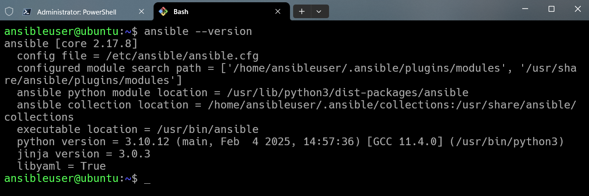

* Now, let's try to connect the windows server from our local machine

    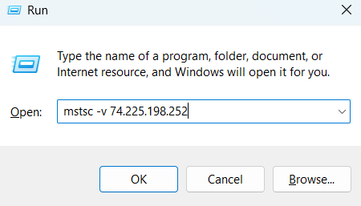

    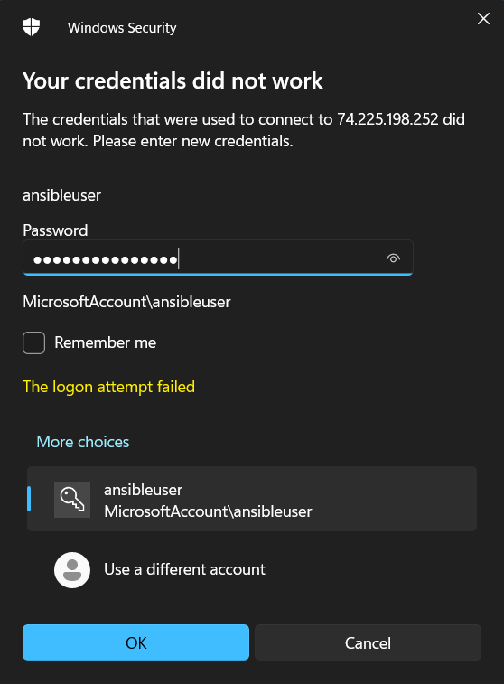

    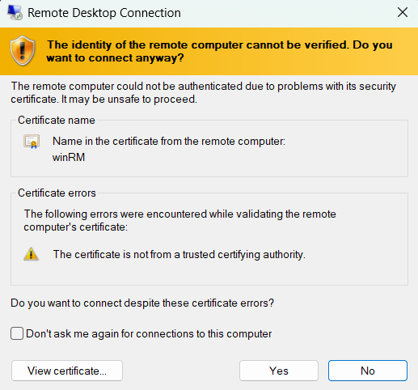

    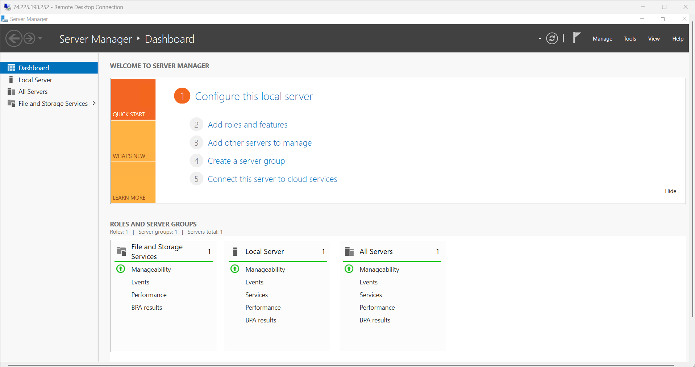

* Now, we are connected to windows-VM let's start the elevated powershell and run few commands

* Here's the link to download/install script to enable _**[WinRM](https://raw.githubusercontent.com/ansible/ansible-documentation/c84880386a2f123ad5ee999bccfea4a502868663/examples/scripts/ConfigureRemotingForAnsible.ps1)**_ on Windows-VM

* Next, check the screenshots for further steps on powershell
    
    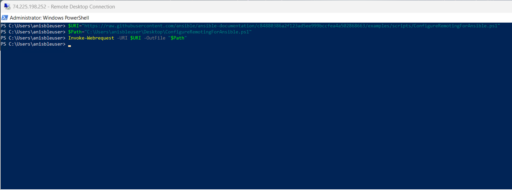
    
    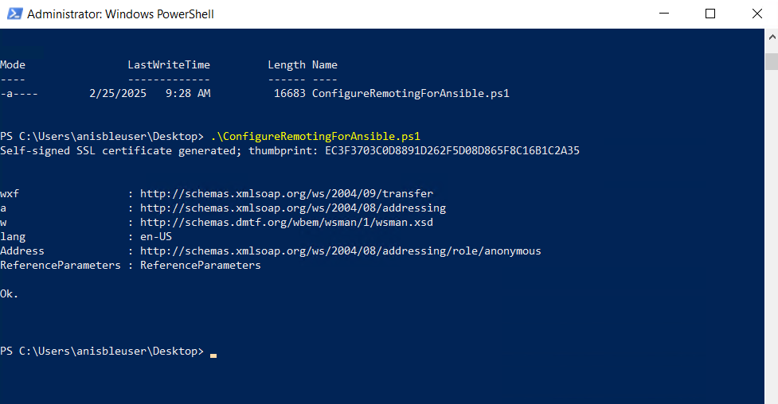

* Now, we also need to verify if python is pre-installed on Windows-VM
    
    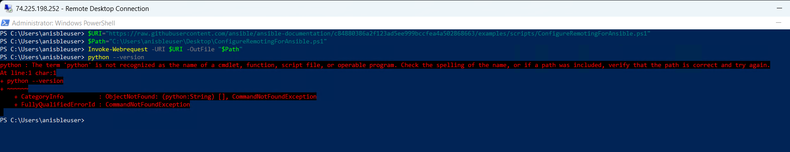

* So, as we can see that python is not installed on Windows-VM, so we need to install chocolatey and then we need to install python using chocolatey

* With PowerShell, we must ensure `Get-ExecutionPolicy` is not Restricted in order to execute external commands. `RemoteSigned` or `AllSigned` are quite a bit more enhanced security
```
Get-ExecutionPolicy
```

* If the policy is `restricted`, then we can change it to `RemoteSigned` or `AllSigned`
```powershell
Set-ExecutionPolicy -ExecutionPolicy RemoteSigned -Scope CurrentUser
```

* Let's try to install [_**chocolatey**_](https://chocolatey.org/install)
```powershell
Set-ExecutionPolicy Bypass -Scope Process -Force; [System.Net.ServicePointManager]::SecurityProtocol = [System.Net.ServicePointManager]::SecurityProtocol -bor 3072; iex ((New-Object System.Net.WebClient).DownloadString('https://community.chocolatey.org/install.ps1'))
```

* Wait a few seconds for the command to complete.
* If you don't see any errors, you are ready to use Chocolatey! Type `choco` or `choco -?`
    
    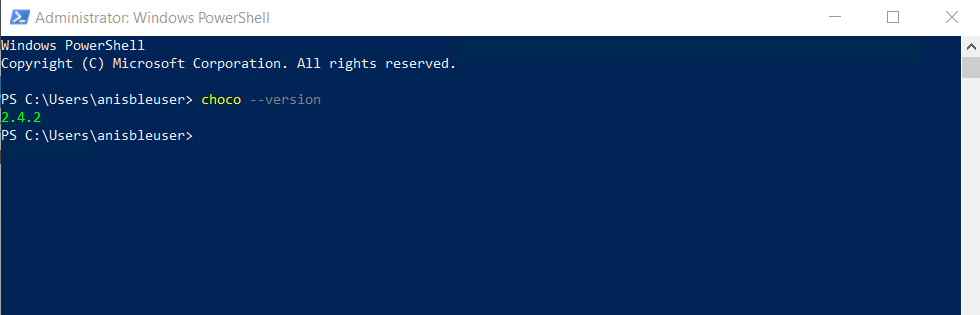

* Next step is to restart the windows server to get the installations effects

* After restarting powershell, let's install python using this command -
```
choco install python --pre 
```

* Next Check if the python is successfully installed or not
```
python --version
```

* Now we should be good with connecting the linux-vm with windows-VM 
* Create a hosts.ini file on ubuntu with below content

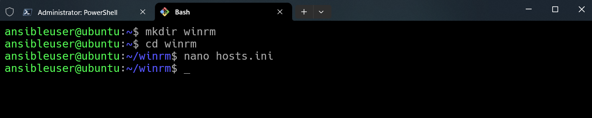

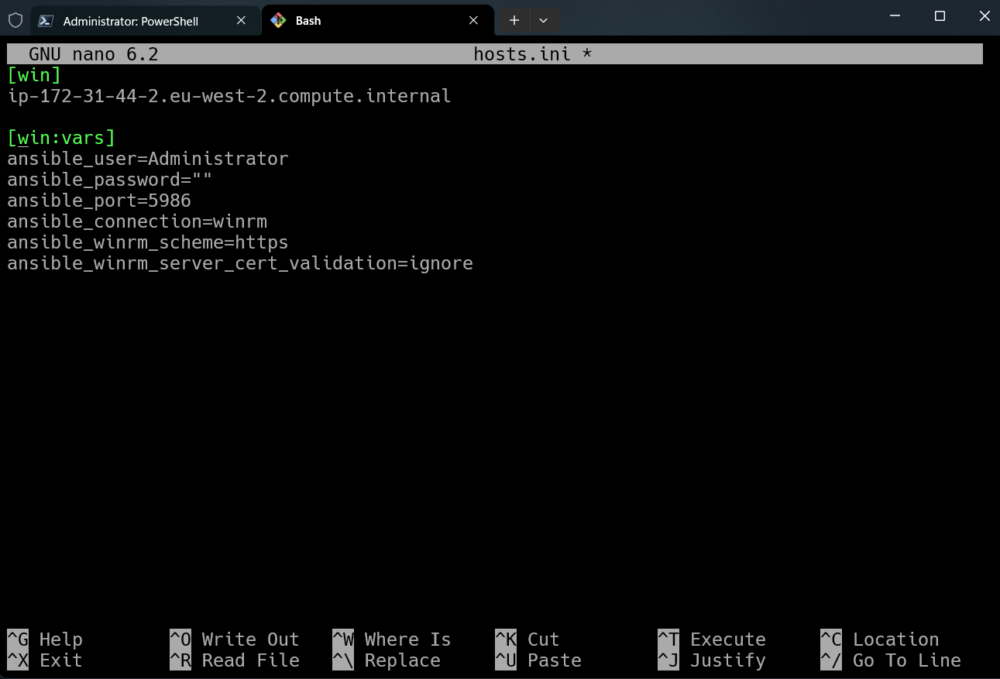

```ini
[win]
<Windows-Server Public/Private IP-Address> or <Public/Private IP DNS name>
#ip-172-31-44-2.eu-west-2.compute.internal

[win:vars]
ansible_user=Administrator
ansible_password="<Windows Server Password to login"
ansible_port=5986
ansible_connection=winrm
ansible_winrm_scheme=https
ansible_winrm_server_cert_validation=ignore
/#ansible_become_method=yes
```


* Now, let's Run win_ping
```
ansible -i hosts.ini win -m win_ping
```
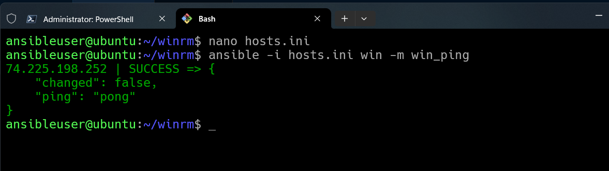

* Okay, since everything seems promising, so let's try to run some sample scripts and also these sample scripts will be available in GitHub for your future references

* Hence, the ansible commands would be -
```bash
ansible-playbook -i hosts.ini win_ssh.yaml
```

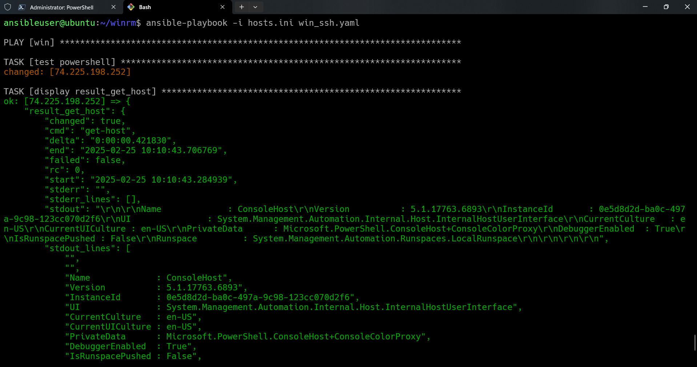

```bash
ansible-playbook -i hosts.ini windows.yaml
```

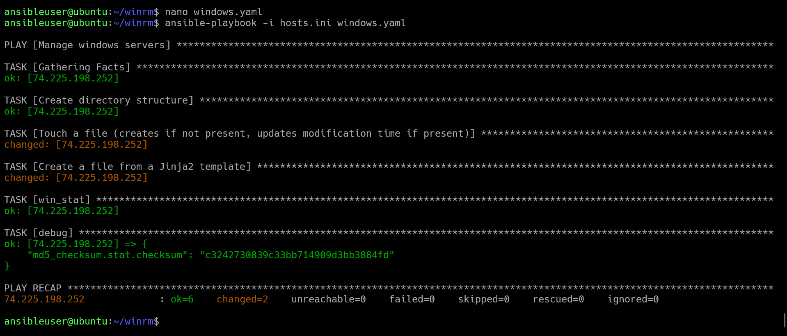

* Also, as we can see the file `foo.txt.j2` which was copied from ubuntu to Windows-VM has something to say

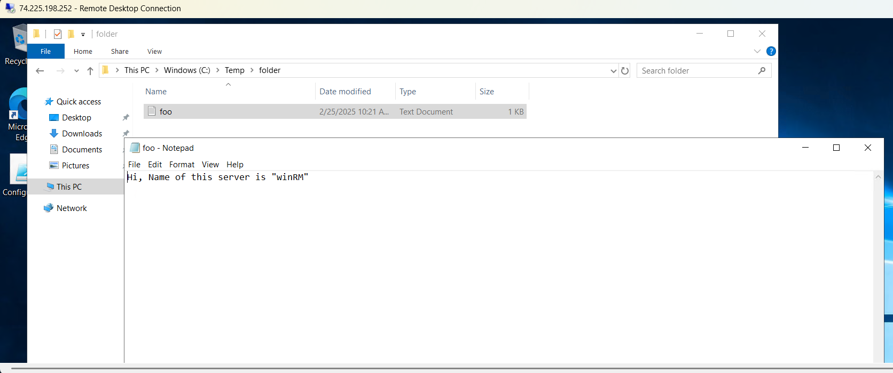

* So, finally I would say it's kind of fun playing around with Ansible playbooks. And I really enjoy this stuff


## References ~

> _**[How can I see what ports are open on my machine?](https://askubuntu.com/questions/9368/how-can-i-see-what-ports-are-open-on-my-machine){:target="_blank"}**_

